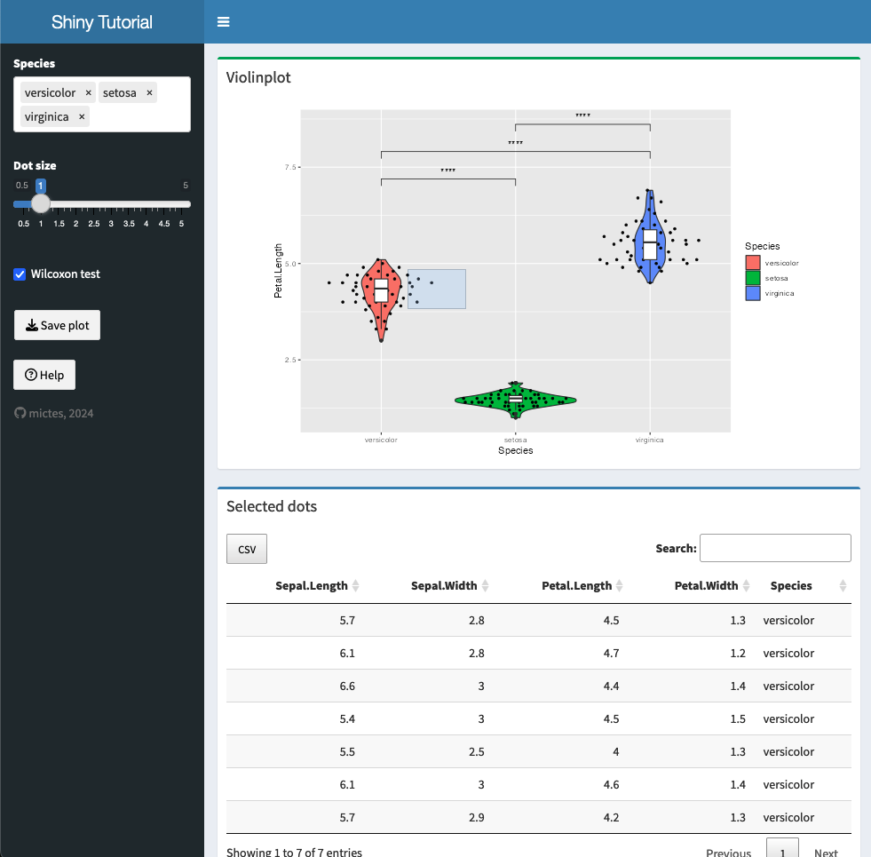

# Example app

The aim of the course is to create something similar to this example app in your own flavour. 

> The app uses the Iris dataset and provides a violin plot with customisable point sizes via a slider. The iris species displayed can be selected and ordered by drag-and-drop and significance levels are optionally shown. The plot can be downloaded as a PDF file. It is possible to select an area of the plot, with details of the selected points displayed in a table below. The contents of the table can be downloaded as a csv file, e.g. for further processing in MS Excel. A double-click zooms into the selected area. In addition, a help button is available to guide the user through the app's functions.

You can view the app here: <a href="https://mictes.shinyapps.io/tutorial/" target="_blank">https://mictes.shinyapps.io/tutorial/</a>

Source code download:

<a href="../R_code/tutorial_app.R" target="_blank" class="md-button md-button--primary">tutorial_app.R</a>

